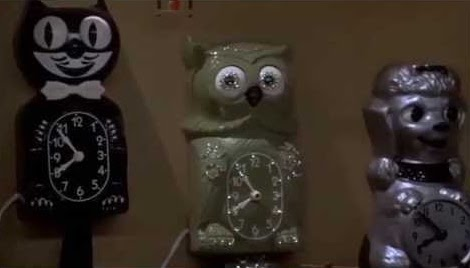
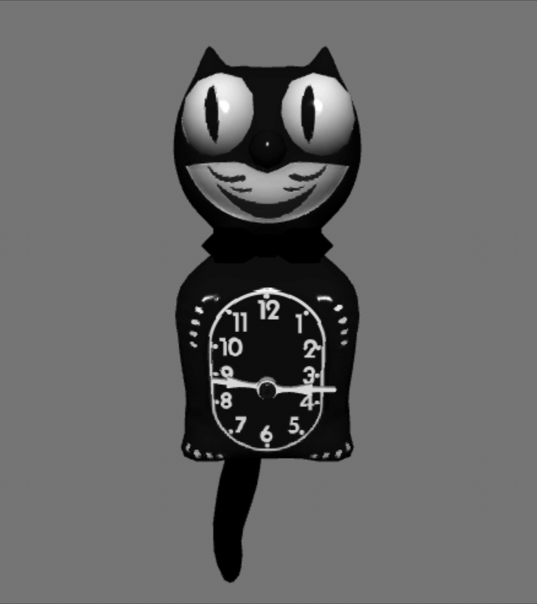
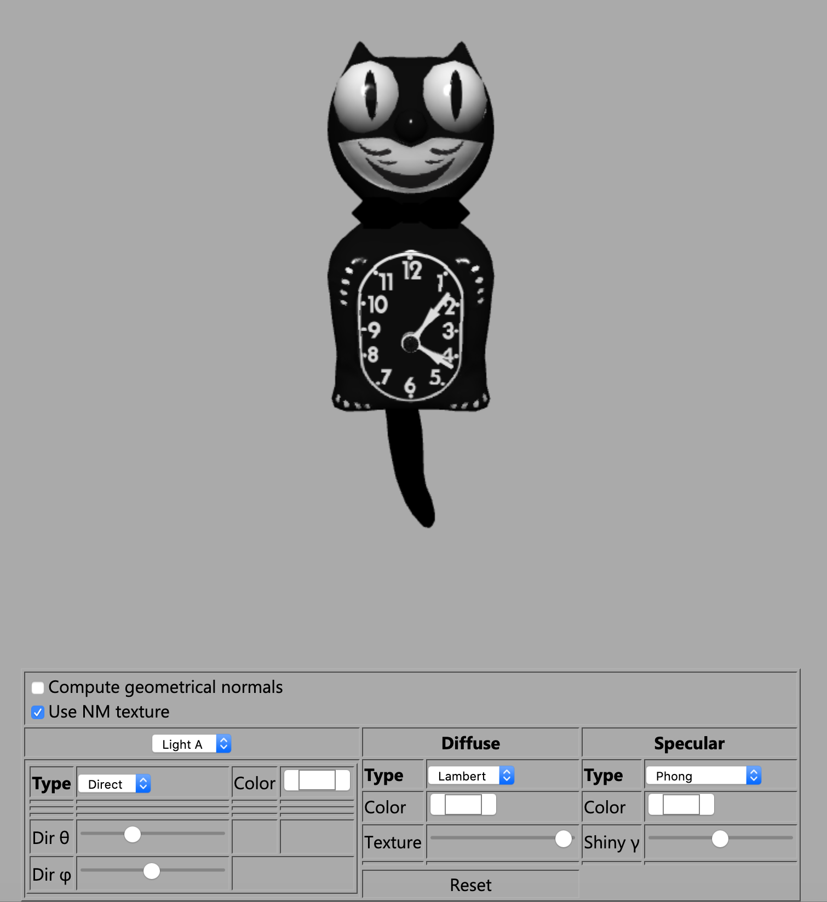
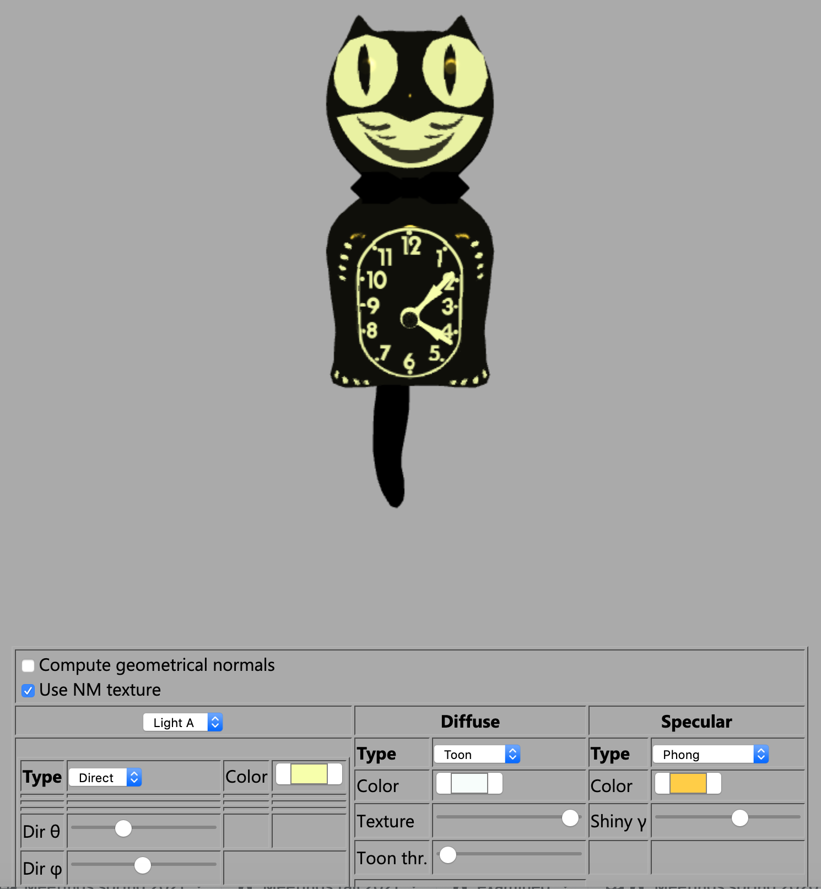
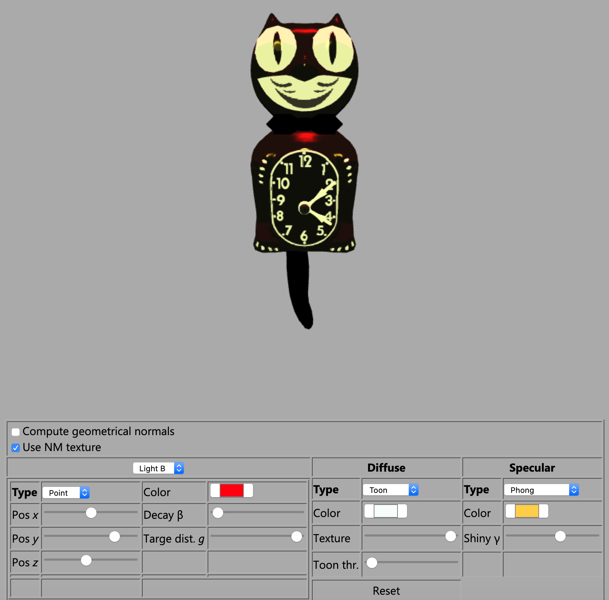
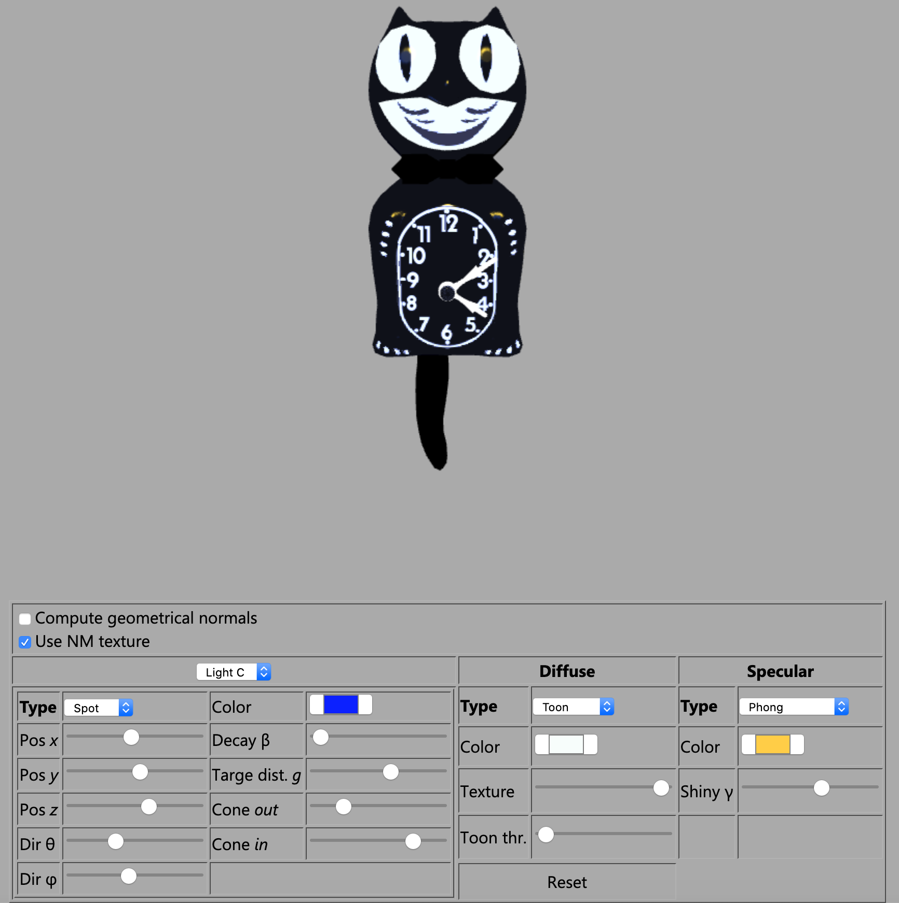

# [Computer Graphics](https://www11.ceda.polimi.it/schedaincarico/schedaincarico/controller/scheda_pubblica/SchedaPublic.do?&evn_default=evento&c_classe=712745&polij_device_category=DESKTOP&__pj0=0&__pj1=0451f4bfa941b844b219b97b3aab0ffb) 2020, Course Project

*Politecnico di Milano - MSc in Computer Science and Engineering*

- [Computer Graphics 2020, Course Project](#computer-graphics-2020-course-project)
  - [Project Description](#project-description)
  - [Implementation](#implementation)
    - [Textures](#textures)
    - [UI Controls](#ui-controls)
      - [**Lights**](#lights)
      - [**Camera**](#camera)
    - [Eyes and Tail Movement](#eyes-and-tail-movement)
    - [Clockhands Movement](#clockhands-movement)
  - [Building and Deploying the project](#building-and-deploying-the-project)
  - [Screenshots](#screenshots)

## Project Description

The aim of this project was to develop a WebGL application and associated OpenGL shaders that will render a 3D model of Cat Wall Watch like the one below from a frame of *[Back to the Future](https://en.wikipedia.org/wiki/Back_to_the_Future)*.

## Implementation
The application has been written in JavaScript and GLSL and consists of different [3D .obj files](./model/) with the requirement that the final implementation should show the current time and the movement of the cat's eyes and tail needs to be in the same direction, as the real clock does.

The final result is:

### Textures
Most of the components of the watch use two kinds of textures: a normal color texture and a [normal map texture](https://en.wikipedia.org/wiki/Normal_mapping) that encodes information about normal vectors for each internal point of a triangle. Because of the [tangent space encoding](https://en.wikipedia.org/wiki/Normal_mapping#Calculating_tangent_space) of this values in the normal map, the fragment shader will perform an *on-the-fly* computation of geometrical normals to obtain the tangent and bitangent vectors.
This dynamic computation can be enabled in the UI control *"Compute geometrical normals"* and is not enabled by default because using the normal vector direction stored with the geometry results in a better rendering.

### UI Controls
In addition to a simple implementation of the cat watch I've also implemented an interface to control the lights inside the scene, with the related diffuse and specular effects. This UI communicates directly with the GLSL program of each 3D component setting the current option, light positions and colors.

#### **Lights**
It's possible to enable up to 3 different types of lights in the scene: [directional](https://en.wikipedia.org/wiki/Computer_graphics_lighting#Directional), [point](https://en.wikipedia.org/wiki/Computer_graphics_lighting#Point) and [spot](https://en.wikipedia.org/wiki/Computer_graphics_lighting#Spotlight) lights, with their related color, coordinates and angles. In addition to that I've implemented [Diffuse](https://en.wikipedia.org/wiki/Computer_graphics_lighting#Diffuse)(Lambert, Toon) and [Specular](https://en.wikipedia.org/wiki/Computer_graphics_lighting#Specular) (Phong, Blinn, Toon Phong, Toon Blinn).

#### **Camera**
The camera looks at the cat and, by default, it's set at the coordinates `x = 0.0`, `y = 0.05`, `z = 0.2`. However it's possible to change these parameters and move the "eye" around the object by using the arrow keys to change coordinates `x` and `y`, and +/- keys to move along the `z` axis.

### Eyes and Tail Movement
The animation of eyes and tail is performed by the function `animate()` of [`main.js`](./main.js) and it relies on the assumption that the `window.requestAnimationFrame` method performs a number of callbacks to it that is usually [60 times per second](https://developer.mozilla.org/en-US/docs/Web/API/window/requestAnimationFrame). Therefore in 60fps the tail and eyes will have 15 frames to move in a fixed direction, 15 frames to return to the centre and again 15+15 frames in the opposite direction, resulting in a 60 frames pendulum movement.
A delta equal to 1, as it's set by default, will move the objects of 15 degrees in both directions.

### Clockhands Movement
The clockhands rotation (in degrees) is calculated on the current time as follows:

`hoursRotationMatrix = rotateZ( -(hour + minutes/60) * 2*Math.PI/12 );`

`minutesRotationMatrix = rotateZ( -minutes * 2*Math.PI/60 );`

where `hour` is a number between 0 and 11 while `minutes` varies from 0 to 59. For a better result the hours clockhand's rotation is also influenced by the number of elapsed minutes.

### Building and Deploying the project
The last version of the project is available at [this GitHub Page](https://ste7en.github.io/ComputerGraphics/) but can also be build offline by cloning this repository and running a webserver (e.g. Apache) in the same folder.

## Screenshots
Fig. 1 - a single white direct light with Lambert diffuse and Phong Specular.

Fig. 2 - a yellow direct light with Toon diffuse and warmer yellow Phong Specular.

Fig. 3 - a yellow direct light and a red point light with Toon diffuse and Phong Specular.

Fig. 4 - in addition to the previous two lights, a blue spot light with Toon diffuse and Phong Specular.

